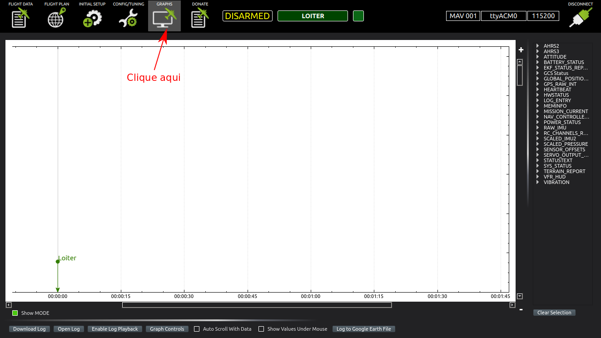
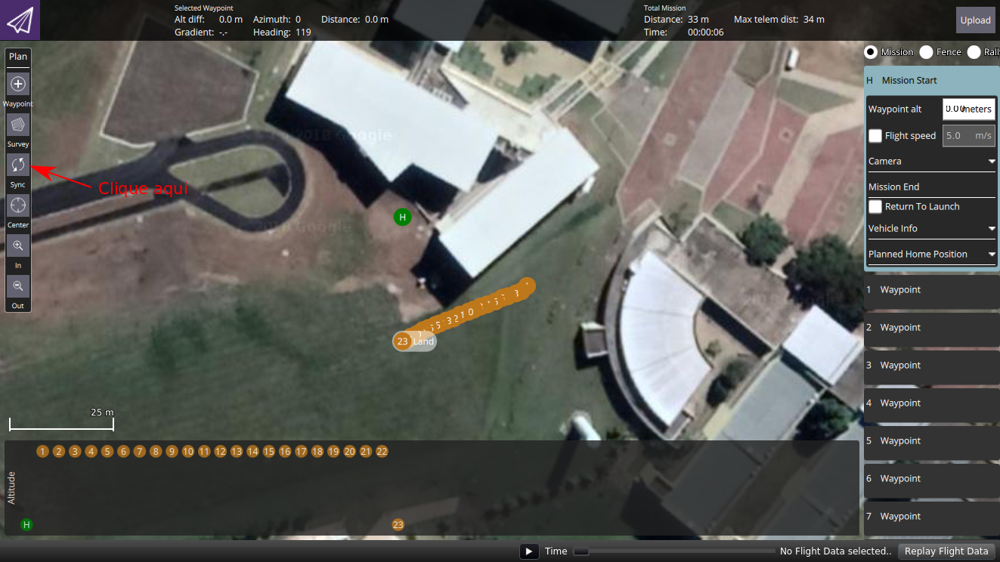

# FAQ

A seguir estão listadas algumas respostas para perguntas frequentes.

Perg1: Estou tentando fazer um voo autônomo com meu drone e aparece no momento de armar a mensagem "low batery" no software UAV-S2DK o que devo fazer.

Resp1: Caso isso aconteça muito provavelmente você possui um sistema de Power Module instalado, para solucionar isso você deve armar o drone de forma manual usando o rádio controle, após fazer isso o drone irá assumir o total controle do drone automaticamente.

Perg2: O meu drone voa para frente mas esta orientado para o lado isso ocorre porque?

Resp2: As vezes percebemos esse efeito em que o drone voa para um lado, mas está orientado para outro. Isso ocorre aparentemente porque foram passados muitos waypoints (com pouco espaço entre eles) e não deu tempo do drone consertar a sua orientação, o drone primeiro preocupa-se em seguir o waypoint não importando a orientação.

Perg3: O drone não está armando na etapa inicial apresentando a mensagem low battery?

Resp3: Tente fazer o arm manual do drone. 

OBS: É sempre bom criar o hábito de ir ao campo e fazer o arm manual, para testar se o piloto automático está tudo ok.

Perg4: O que devo fazer caso o drone decole, mas não mude do modo GUIDED para o modo AUTO?

Resp4: Primeiro você precisa aguardar um tempo, caso nada acontença faça o seguinte. Você poderá fazer isso via estação de base, chaveando o modo que estará em GUIDED para AUTO. E então o drone passa a seguir a rota especificada. No entanto, é provavel que o mesmo não faça o pouso final, dessa forma, basta você trocar na estação de base para o modo LAND.

Perg5: O drone está fazendo uma missão e o mesmo não atinje a altura correta no momento da decolagem o que devo fazer?

Resp5: Pela estação de controle, QGroundControl por exemplo, mude para Loiter dê throttle pelo controle e então volte pela estação de controle para o modo
AUTO.

Perg6: Quais são os principais arquivos que devo baixar após fazer uma missão para posterior análise e escrita de artigos científicos?

Resp6: Abaixo estão listados alguns arquivos que podem ser interessantes fazer o download.

* .bin -> arquivo com o log do voo. Conectar a Pixhawk no notebook via USB. Copiar usando APM Planner o arquivo .bin. Para isso vá em Aba Graphs -> Download Log -> Refresh -> Selecione -> Download Log(s). O arquivo irá em geral para a pasta ~/apmplanner2/dataflashLogs/.
* .tlog -> arquivo com o log do voo. Encontrado na pasta /UAV-Toolkit/Scripts/MyCopter/logs/DATA/
* .tlog.raw -> arquivo com o log do voo. Encontrado na pasta /UAV-Toolkit/Scripts/MyCopter/logs/DATA/
* .parm -> arquivo com os parâmetros do drone. Encontrado na pasta /UAV-Toolkit/Scripts/MyCopter/logs/DATA/
* routeGeo.txt -> Caso tenha usado CCQSP4m. Encontrado na pasta /UAV-Toolkit/Modules-MOSA/CCQSP4m/
* routeGeo*.txt -> Caso tenha usado HGA4m. Encontrado na pasta /UAV-Toolkit/Modules-MOSA/HGA4m/. Onde * significa todos os números.
* routeGeo.txt -> Caso tenha usado HGA4m. Encontrado na pasta /UAV-Toolkit/Modules-IFA/MPGA4s/
* log-aircraft?.csv -> arquivo de log do sistema UAV-Tookit. Onde ? significa o último número.
* log-overhead-ifa?.csv - > arquivo de log de overhead do sistema IFA. Onde ? significa o último número.
* log-overhead-mosa?.csv -> arquivo de log de overhead do sistema MOSA. Onde ? significa o último número.
* .h264 -> se fez vídeo. Encontrado na pasta /UAV-Toolkit/Modules-Global/Camera/videos/
* .jpg -> se retirou foto. Encontrado na pasta /UAV-Toolkit/Modules-Global/Camera/pictures/
* .jpg -> se retirou fotos em sequência. Encontrado na pasta /UAV-Toolkit/Modules-Global/Camera/photos-in-sequence/
* config-global.properties -> arquivo de properties com dados de configuração usados no voo real. Encontrado na pasta /UAV-Toolkit/Modules-Global/
* config-param.properties -> arquivo de properties com dados dos parâmetros usados no voo real. Encontrado na pasta /UAV-Toolkit/Modules-Global/

Perg7: Como limpar os Logs da placa controladora Pixhawk?

Resp7: Abaixo estão os seguintes passos para você limpar uma missão no piloto automático Pixhawk. Estes passos foram necessários, pois de alguma forma a Pixhawk estava fazendo um merge das missões (logs).
Os passos abaixo foram usando os softwares APM Planner 2 e QGroundControl. Estes passos podem ser feitos usando apenas o QGroundControl também.

As duas próximas figuras mostram como apagar o arquivo .bin.

As três próximas figuras mostram como apagar a missão do piloto automático.

