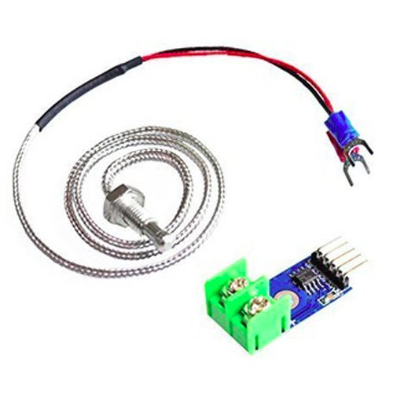
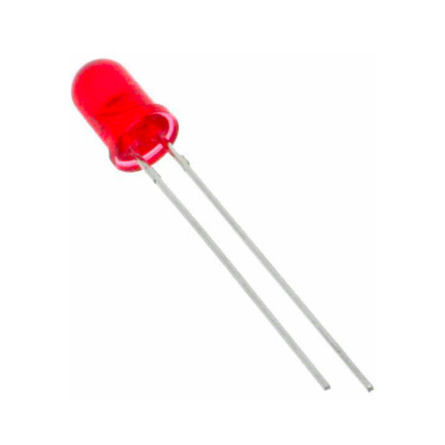

# Modules-Global

Este diretório é responsável por agrupar um conjunto de algoritmos e módulos de hardware usados pelo sistema IFA e MOSA. 

Os diretórios a seguir contém códigos utilizados pelo sistema IFA.

* **Buzzer** -> Código responsável por acionar o alarme do drone após ocorrer uma falha crítica. 
* **Parachute** -> Código responsável por acionar o paraquedas do drone após ocorrer uma falha crítica. 
* **Sonar** -> Código responsável por fazer leituras de distância do drone até o solo.
* **LED** -> Código responsável por acionar ou apagar alguns LEDs do drone.
* **Temperature** -> Código responsável por pegar dados do sensor de temperatura para verificação de superaquecimento do drone.

Os diretórios a seguir contém códigos utilizados pelo sistema MOSA.

* **Buzzer** -> Código responsável por acionar o buzzer do drone após um waypoint específico ter sido alcançado. 
* **Camera** -> Código responsável por fazer a retirada de fotografia e vídeos conforme acionado pelo sistema MOSA.
* **LED** -> Código responsável por acionar ou apagar alguns LEDs do drone.
* **Spraying** -> Código responsável por abrir ou fechar o sistema de pulverização do drone.
* **Route-Simplifier** -> Código responsável por fazer a simplificação de waypoints de forma a tornar mais leve para o piloto automático a execução da rota.

O diretório Files contém arquivos utilizados pelo sistema MOSA e IFA.

* **geoBase.txt** -> Arquivo com as coordenadas de longitude, latitude e altitude usado na transformação para coordenadas cartesianas.
* **featureMission.txt** -> Arquivo que contém as coordenadas de latitude, longitude e altitude, em que deve-se acionar o buzzer, câmera foto, câmera vídeo e spraying.
* **map-full.sgl** -> Arquivo de mapa completo (contendo obstáculos, região penalizadora e região bonificadora) usado pelo sistema.
* **map-nfz.sgl** -> Arquivo de mapa com apenas os obstáculos usado pelo sistema.

## Arquivos de configuração

Este diretório também possui dois arquivos de configuração que são:

* **config-global.properties** -> Arquivo usado pelos sistemas MOSA, IFA, GCS, S2DK para descrever os aspectos gerais da missão/segurança.
* **config-param.properties** -> Arquivo usado pelo sistema IFA para calibrar os parâmetros de voo do Piloto Automático.

## Síntese: 

Abaixo encontra-se uma tabela sintetizando os principais módulos presentes nessa pasta e suas características.

| Característica              | Câmera         | Sonar               | Temperature      | Buzzer        | LED           | Parachute     | Spraying      | Route-Simplifier    |
|-----------------------------|----------------|---------------------|------------------|---------------|---------------|---------------|---------------|---------------------|
| Tipo                        | Sensor         | Sensor              | Sensor           | Atuador       | Atuador       | Atuador       | Atuador       | Otimizador de Rotas |
| Marca/Modelo                | Camera RPi v1  | HC-SR04             | MAX6675          | Buzzer 12V    | LED Red 5mm   |               |               | N/A                 |
| Dependência de Bibliotecas  | picamera       | RPi                 | RPi e WiringPi   | mraa          | Adafruit_BBIO |               |               | Não tem             |
| Linguagem                   | Python         | Python              | Python ou C      | Python        | Python        |               |               | Python              |
| Aplicação que Utiliza       | MOSA           | IFA                 | IFA              | IFA/MOSA      | IFA/MOSA      | IFA           | MOSA          | MOSA                |
| Tem versão PC               | Sim            | Sim (Simulado)      | Sim (Simulado)   | Sim           | Não           | Não           | Não           | N/A                 |
| Totalmente Funcional        | Sim            | Sim                 | Sim              | Sim           | Sim           | Não           | Não           | Sim                 |
| Imagem                      |  |  |  |  |  |  |  |  |

A tabela abaixo sintetiza algumas informações sobre o sensor câmera.

| Característica           | Câmera                  | Câmera                       | Câmera                 | Observação                               |
|--------------------------|-------------------------|------------------------------|------------------------|------------------------------------------|
| Tipo de Ação             | Retirar Foto            | Retirar Fotos em Sequência   | Fazer Vídeo            |                                          |
| Código para Raspberry Pi | picture-rpi.py          | photo-in-sequence-rpi.py     | video-rpi.py           |                                          |
| Código para PC           | picture-pc.jar          | photo-in-sequence-pc.jar     | video-pc.jar           | Print screen, print screens e grava tela |

A tabela abaixo sintetiza algumas informações sobre o sensor sonar.

| Característica           | Sonar                 | Observação             |
|--------------------------|-----------------------|------------------------|
| Tipo de Ação             | Calcula Distância     |                        |
| Código para Edison       | sonar-edison.py       | Não testado            |
| Código para Raspberry Pi | sonar-rpi.py          |                        |
| Código para BBB          | sonar-bbb.py          | Não testado            |
| Código para PC           | sonar-pc.jar          | Dados apenas simulados |

A tabela abaixo sintetiza algumas informações sobre o sensor de temperatura.

| Característica           | Temperature           | Observação             |
|--------------------------|-----------------------|------------------------|
| Tipo de Ação             | Calcula a Temperatura |                        |
| Código para Edison       | temperature-edison.py | Não testado            |
| Código para Raspberry Pi | temperature-rpi.py    |                        |
| Código para Raspberry Pi | temperature-rpi.c     |                        |
| Código para BBB          | temperature-bbb.py    | Não testado            |
| Código para PC           | temperature-pc.jar    | Dados apenas simulados |

A tabela abaixo sintetiza algumas informações sobre o atuador buzzer.

| Característica           | Buzzer                  | Buzzer                       | Observação             |
|--------------------------|-------------------------|------------------------------|------------------------|
| Tipo de Ação             | Aciona um Beep (Buzzer) | Aciona vários Beeps (Alarme) |                        |
| Código para Edison       | buzzer-edison.py        | alarm-edison.py              |                        |
| Código para Raspberry Pi | buzzer-rpi.py           | alarm-rpi.py                 |                        |
| Código para BeagleBone   | buzzer-bbb.py           | alarm-bbb.py                 |                        |
| Código para PC           | buzzer-pc.jar           | alarm-pc.jar                 | Aciona o buzzer do pc  |

A tabela abaixo sintetiza algumas informações sobre o atuador LED.

| Característica           | LED                     | LED                          | Observação             |
|--------------------------|-------------------------|------------------------------|------------------------|
| Tipo de Ação             | Liga o LED              | Pisca o LED (Blink)          |                        |
| Código para Edison       | turn-on-led-edison.py   | blink-led-edison.py          | Não testado            |
| Código para Raspberry Pi | turn-on-led-rpi.py      | blink-led-rpi.py             |                        |
| Código para BBB          | turn-on-led-bbb.py      | blink-led-bbb.py             |                        |

A tabela abaixo sintetiza algumas informações sobre o atuador Parachute.

| Característica           | Parachute                | Observação             |
|--------------------------|--------------------------|------------------------|
| Tipo de Ação             | Abre o paraquedas        |                        |
| Código para Edison       | open-parachute-edison.py | Não testado            |
| Código para Raspberry Pi | open-parachute-rpi.py    |                        |
| Código para BBB          | open-parachute-bbb.py    |                        |

A tabela abaixo sintetiza algumas informações sobre o atuador Spraying.

| Característica           | Spraying                | Spraying                 | Observação             |
|--------------------------|-------------------------|--------------------------|------------------------|
| Tipo de Ação             | Abre o pulverizador     | Fecha o pulverizador     |                        |
| Código para Edison       | open-spraying-edison.py | close-spraying-edison.py | Não testado            |
| Código para Raspberry Pi | open-spraying-rpi.py    | close-spraying-rpi.py    |                        |
| Código para BBB          | open-spraying-bbb.py    | close-spraying-bbb.py    |                        |

A tabela abaixo sintetiza alguns detalhes sobre a implementação do simplificador de rotas. Pode-se perceber nessa tabela que os métodos do MOSA (HGA4m e CCQSP4m) suportam a simplificação de rotas, sejam executando de forma onboard ou offboard. Nota-se também que todos os métodos do IFA (como, MPGA4s, GA4s, DE4s, etc) não suportam esse recurso (por enquanto, esse recurso será adicionado em breve), execuntando onboard ou offboard. Por fim, pode-se perceber que apenas o método CCQSP4m (executando onboard) suporta o simplificador de rotas de forma automática. Isso significa que mesmo que eu não ative explicitamente o simplificador, o mesmo será executado caso o tamanho da rota ultrapasse o tamanho máximo suportado pelo piloto. Vale lembrar que o número máximo de waypoints suportados pela APM v2.8 é 166 e a Pixhawk v1.0 é 718. Vamos supor então que o planejador CCQSP4m (executando onboard) gerou uma rota com 200 waypoints e estamos usando a APM, se tentarmos passar tal rota para o piloto automático irá dar um erro, mas foi adicionado um recurso, onde o simplificador de rotas automaticamente será chamado para previnir tais erros de lógica.

| Característica                                 | HGA4m Onboard   | HGA4m Offboard  | CCQSP4m Onboard | CCQSP4m Offboard | Métodos-IFA Onboard | Métodos-IFA Offboard |
|------------------------------------------------|-----------------|-----------------|-----------------|------------------|---------------------|----------------------|
| Suporta Simplificador de Rotas                 | Sim             | Sim             | Sim             | Sim              | Não                 | Não                  |
| Suporta Simplificador de Rotas Automaticamente | Não             | Não             | Sim             | Não              | Não                 | Não                  |

A tabela abaixo sintetiza algumas informações sobre os Companions Computers e o suporte a alguns dispositivos de hardware (sensores/atuadores).

| Sensor/Atuador                  | Intel Edison    | Raspberry Pi 2, 3 | BeagleBone Black | Odroid C1     |
|---------------------------------|-----------------|-------------------|------------------|---------------|
| Suporta Sensor Sonar            | Não             | Sim               | Não              | Não           |
| Suporta Sensor Temperatura      | Não             | Sim               | Não              | Não           |
| Suporta Câmera                  | Não             | Sim               | Não              | Não           |
| Suporta Buzzer                  | Sim             | Não               | Sim              | Não           |
| Suporta LED                     | Não             | Sim               | Sim              | Não           |
| Suporta Parachute               | Não             | Não               | Não              | Não           |
| Suporta Spraying                | Não             | Não               | Não              | Não           |

:warning: **OBS:** Os códigos (turn-on-led-bbb.py, blink-led-bbb.py, etc) quando executados sobre a BBB necessitam de sudo para rodar. Para solucionar isso necessita fazer uma série de configurações nesta placa. Dessa forma, recomenda-se não executar tais códigos sem antes verificar se estão funcionando. Caso tem-se executar os códigos no sistema não dará nenhum problema apenas não serão executados como se deseja.

:warning: **OBS:** Os códigos picture-rpi.py, photo-in-sequence-rpi.py e video-rpi.py necessitam de permissão para gravar os dados na pasta na Raspberry Pi, dessa forma, certifique-se que você deu permissão total para a pasta através dos comandos: 
```
chmod 777 Camera/pictures/
chmod 777 Camera/photos-in-sequence/
chmod 777 Camera/videos/
```

:warning: **OBS:** A câmera da Raspberry Pi 3 possui como orientação principal nas fotografias/filmagens a direção do cabo flat da câmera. Dessa forma, o cabo deve ficar orientado para baixo, assim a foto/filmagem ficará orientada de forma correta.
