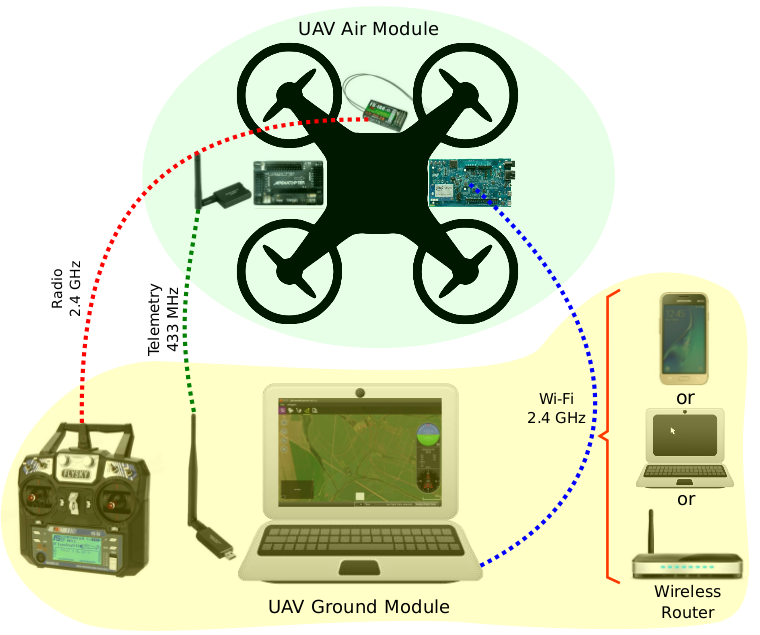

# UAV-Toolkit

Conjunto de ferramentas desenvolvidas para automatização de voos de Veículos Aéreos Não-Tripulados (VANTs) ou *Unmanned Aerial Vehicles* (UAVs).
Entre os principais sistemas aqui desenvolvidos podemos citar o sistema MOSA [[Link da Tese](http://www.teses.usp.br/teses/disponiveis/55/55134/tde-12072016-102631/pt-br.php)] e o sistema IFA [[Link da Tese](http://www.teses.usp.br/teses/disponiveis/55/55134/tde-03122015-105313/pt-br.php)].


## Visão Geral

Nesse projeto podemos encontrar os seguintes diretórios:

* **Docs** -> Documentação escrita sobre esse projeto. Dissertação, Qualificação e Tutorial.
* **Instances** -> Conjunto de arquivos de instâncias de mapas artificiais e reais utilizados nos experimentos.
* **Libs** -> Bibliotecas utilizadas nos projetos aqui descritos.
* **Missions-Ardupilot-SITL** -> Agrupa um conjunto de missões para serem simuladas no ardupilot SITL.
* **Missions-Google-Earth** -> Agrupa um conjunto de missões feitas usando o software Google Earth.
* **Modules-Global** -> Agrupa um conjunto de código para acionar os sensores e atuadores.
* **Modules-IFA** -> Agrupa um conjunto de algoritmos usados pelo sistema IFA.
* **Modules-MOSA** -> Agrupa um conjunto de algoritmos usados pelo sistema MOSA.
* **Scripts** -> Agrupa um conjunto de scripts utilizados para facilitar a execução de experimentos.
* **UAV-Ensemble-GA-GA_GA-GH** -> Implementação em Java dos algoritmos de comitê GA-GA e GA-GH executados em paralelo (usado pelo IFA).
* **UAV-Exec-PathReplanner-Massive** -> Implementação em Java de execuções massivas de replanejamento de rota (usado pelo UAV-Fixed-Route4s).
* **UAV-Fixed-Route4s** -> Implementação em Java para definição da melhor rota de pouso emergencial em um conjunto de rotas (usado pelo IFA).
* **UAV-GCS** -> Projeto em Java que gerenciamento/controle/acompanhamento do voo autonomo usando o MOSA e IFA.
* **UAV-Generic** -> Projeto em Java que contém estruturas genéricas ao sistema MOSA e IFA.
* **UAV-IFA** -> Projeto em Java para gerenciamento da segurança em voo.
* **UAV-MOSA** -> Projeto em Java para gerenciamento da missão em voo.
* **UAV-Mission-Creator** -> Projeto em Java que auxilia a criar missões e mapas usando o Google Earth.
* **UAV-Monitoring** -> Projeto em Java para monitoramento dos sensores e informações da aeronave.
* **UAV-PosAnalyser** -> Projeto em Java para monitoramento da posição da aeronave.
* **UAV-SOA-Interface** -> Código em python que provê serviços de acesso a informações do drone através do dronekit.
* **UAV-Tests** -> Projeto em Java para execução de testes das funcionalidades do UAV-SOA-Interface.

## Instalação

### Pré-Requisitos de Instação:

É necessário possuir instalado em seu computador os seguintes softwares/pacotes: 

* python 2.7 [[Link](https://www.python.org/)]
* dronekit [[Link](http://python.dronekit.io/)]
* dronekit-sitl [[Link](http://python.dronekit.io/)]
* Mavproxy [[Link](http://ardupilot.github.io/MAVProxy/html/index.html)]
* QGroundControl [[Link](http://qgroundcontrol.com/)] 
ou 
* APM Planner 2.0 [[Link](http://ardupilot.org/planner2/index.html)] 
ou 
* Mission Planner [[Link](http://ardupilot.org/planner/docs/mission-planner-overview.html)]

### Instalação Caso I:

Caso você deseje modificar o projeto atual incluindo melhorias, então deve-se ter instalado em seu computador a IDE Netbeans ou alguma outra IDE de seu interesse.

Logo em seguida, você deverá clonar o nosso repositório:

`git clone https://github.com/jesimar/UAV-Toolkit.git`

Uma vez terminado, navegue até o diretório RAIZ. Neste caso você estará em ./UAV-Toolkit:

Então você poderá importar cada um dos projetos que você deseja melhorar. 

### Instalação Caso II:

Caso você deseje apenas utilizar o projeto atual sem incluir melhorias, então não é necessária a instação de nenhuma IDE para edição dos projetos desenvolvidos.

Logo em seguida, você deverá fazer o download do último release do nosso projeto:

`https://github.com/jesimar/UAV-Toolkit/releases`

Uma vez terminado, navegue até o diretório RAIZ. Neste caso você estará em ./UAV-Toolkit:

Pronto, o projeto já está pronto para o uso.

## Características do Sistema

* O sistema IFA é o servidor (mestre, host) tem que ser executado antes do MOSA.
* O sistema IFA suporta apenas um cliente MOSA. 

## Citação

Se você usar o UAV-Toolkit, por favor, cite minha Qualificação de Doutorado [[PDF](./Docs/Qualificação-Jesimar-2017.pdf)].

```
@phdthesis{ArantesJS2017Tese,
  author = {Jesimar da Silva Arantes},
  title = {Sistema autônomo para supervisão de missão e segurança de voo em VANTs},
  school = {Universidade de São Paulo (USP)},
  year = {2017},
  month = {ago},
  pages = {1--140},
  note = {São Carlos, SP},
  type = {Qualificação de Doutorado}
}
```

O artigo abaixo contém um pouco dos detalhes do sistema IFA e MOSA implementados [[Link](https://dl.acm.org/citation.cfm?id=3071178.3071302)].

```
@inproceedings{ArantesJS2017GECCO,
  author = {da Silva Arantes, Jesimar and da Silva Arantes, M\'{a}rcio and Toledo, Claudio Fabiano Motta and J\'{u}nior, Onofre Trindade and Williams, Brian C.},
  title = {An Embedded System Architecture Based on Genetic Algorithms for Mission and Safety Planning with UAV},
  booktitle = {Proceedings of the Genetic and Evolutionary Computation Conference},
  series = {GECCO '17},
  year = {2017},
  isbn = {978-1-4503-4920-8},
  location = {Berlin, Germany},
  pages = {1049--1056},
  numpages = {8},
  url = {http://doi.acm.org/10.1145/3071178.3071302},
  doi = {10.1145/3071178.3071302},
  acmid = {3071302},
  publisher = {ACM}
} 
```

## Changelog

A versão do ChangeLog pode ser acessado [aqui](https://github.com/jesimar/UAV-Toolkit/blob/master/CHANGELOG.md). 

## Licença

UAV-Toolkit está disponível sobre código aberto com permissões [GNU General Public License v3.0](https://github.com/jesimar/UAV-Toolkit/blob/master/LICENSE). 

------

Copyright 2018 - Jesimar da Silva Arantes.


<!--
## Arquitetura de Hardware





-->
