# UAV-Toolkit

<p align="center">
  <a href="#">
    
  </a>
  <a href="https://github.com/jesimar/UAV-Toolkit/tree/master/UAV-IFA">
    
  </a>
  <a href="https://github.com/jesimar/UAV-Toolkit/tree/master/UAV-MOSA">
    
  </a>
  <a href="https://github.com/jesimar/UAV-Toolkit/graphs/commit-activity" target="_blank">
    
  </a>
</p>

O projeto UAV-Toolkit agrupa um conjunto de ferramentas desenvolvidas para automatização de voos de Veículos Aéreos Não-Tripulados (VANTs), ou ainda, *Unmanned Aerial Vehicles* (UAVs). Essas ferramentas são frutos do trabalho que vem sendo desenvolvido pelo doutorando da USP Jesimar da Silva Arantes como seu desenvolvedor principal, outros desenvolvedores/contribuidores podem ser acessados [aqui](https://github.com/jesimar/UAV-Toolkit/blob/master/AUTHORS).

Entre os principais sistemas aqui desenvolvidos podemos citar o sistema MOSA, estabelecido por Nina Figueira durante o seu doutorado na USP [[Link da Tese](http://www.teses.usp.br/teses/disponiveis/55/55134/tde-12072016-102631/pt-br.php)], e o sistema IFA estabelecido por André Pierre Mattei durante o seu doutorado na USP [[Link da Tese](http://www.teses.usp.br/teses/disponiveis/55/55134/tde-03122015-105313/pt-br.php)]. Os sistemas MOSA e IFA foram utilizados como modelos de referência para o desenvolvimento desse projeto, dessa forma, nem todas as funcionalidades descritas foram implementadas e diversas outras não presentes no modelo de referência foram implementadas. Dessa forma, a implementação aqui descrita é uma versão dos sistemas MOSA e IFA, e serão aqui chamadas de UAV-MOSA e UAV-IFA.

O projeto UAV-Toolkit oferece suporte aos sistemas operacionais Linux, Mac OS X e Windows, para rodar em modo simulado. O projeto oferece suporte a diversos, computadores de bordo, também chamados de Companion Computer (CC) como: Intel Edison, Raspberry Pi, Beagle Bone, Odroid, etc. O projeto também oferece suporte a diversas placas de piloto automático como APM e Pixhawk.


## Visão Geral

A organização desse projeto foi feita através da separação em diversos diretórios e estão listados a seguir:

* **Docs** -> Documentação escrita sobre esse projeto. Dissertação, Qualificação e Tutorial. [[Docs](./Docs/)]
* **Figures** -> Pasta contendo um conjunto de figuras utilizada na documentação do Github. [[Figures](./Figures/)]
* **Instances** -> Conjunto de arquivos de instâncias de mapas artificiais e reais utilizados nos experimentos. [[Instances](./Instances/)]
* **Libs** -> Bibliotecas utilizadas nos projetos aqui descritos. [[Libs](./Libs/)]
* **Lib-UAV** -> Biblioteca que contém estruturas genéricas ao sistema UAV-MOSA, UAV-IFA e UAV-GCS. [[Lib-UAV](./Lib-UAV/)]
* **Missions** -> Pasta contendo as missões utilizadas pelo sistemas UAV-Mission-Creator, UAV-IFA e UAV-MOSA. [[Missions](./Missions/)]
* **Missions-Google-Earth** -> Agrupa um conjunto de missões feitas usando o software Google Earth. [[Missions-Google-Earth](./Missions-Google-Earth/)]
* **Modules-Global** -> Agrupa um conjunto de código para acionar os sensores, atuadores e módulos gerais. [[Modules-Global](./Modules-Global/)]
* **Modules-IFA** -> Agrupa um conjunto de algoritmos usados pelo sistema IFA. [[Modules-IFA](./Modules-IFA/)]
* **Modules-MOSA** -> Agrupa um conjunto de algoritmos usados pelo sistema MOSA. [[Modules-MOSA](./Modules-MOSA/)]
* **Results** -> Pasta em que serão armazenados os resultados das simulações, caso se copie os resultados. [[Results](./Results/)]
* **Scripts** -> Agrupa um conjunto de scripts utilizados para facilitar a execução de experimentos. [[Scripts](./Scripts/)]
* **UAV-GCS** -> Estação de controle de solo que faz acompanhamento/controle/visualização do voo autônomo usando o MOSA e IFA. [[UAV-GCS](./UAV-GCS/)]
* **UAV-IFA** -> Implementação do sistema IFA que faz o gerenciamento da segurança em voo. [[UAV-IFA](./UAV-IFA/)]
* **UAV-Manager** -> Aplicação que gerencia a instalação e execução de todo o ambiente UAV-Toolkit. [[UAV-Manager](./UAV-Manager/)]
* **UAV-Mission-Creator** -> Aplicação que auxilia a criar missões e mapas usando o Google Earth. [[UAV-Mission-Creator](./UAV-Mission-Creator/)]
* **UAV-MOSA** -> Implementação do sistema MOSA que faz o gerenciamento da missão em voo. [[UAV-MOSA](./UAV-MOSA/)]
* **UAV-S2DK** -> Aplicação que provê serviços de acesso a informações/controle do drone através da biblioteca dronekit e mensagens MAVLink. [[UAV-S2DK](./UAV-S2DK/)]
* **UAV-Tests** -> Sistema para execução de testes das funcionalidades do UAV-S2DK. [[UAV-Tests](./UAV-Tests/)]

## Pré-Requisitos de Instalação (Hardware/SO/UAV): 

Abaixo estão listados alguns pré-requisitos de instalação/configuração do ambiente UAV-Toolkit.

**Arquiteturas suportadas:**

O presente projeto suporta processadores com arquiteturas x86, x64 e ARM (32 e 64 bits). Vale lembrar que as arquiteturas ARM usadas são de computadores de bordo (CC). E as arquiteturas x86 e x64 são tanto arquiteturas PC quanto CC, como a Intel Edison. A tabela abaixo mostra os processadores suportados ou testados.

| Arquitetura x86 x64                                            | Arquitetura ARM                                          |
|----------------------------------------------------------------|----------------------------------------------------------|
|                        | 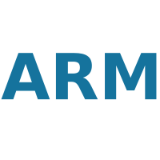                 |
| CPU Testada: Intel i3, i7 (no PC) (64 bits)                    | CPU Testada: ARM Cortex-A7 (RPi 2) (32 bits)             |
| CPU Testada: Intel Core i7-8750H Coffee Lake (no PC) (64 bits) | CPU Testada: ARM Cortex-A53 (RPi 3) (64 bits)            |
| CPU Testada: Intel Atom (Intel Edison)                         | CPU Testada: ARM Cortex-A8 (BB Black Wireless) (64 bits) |

:warning: **OBS:** A presente ferramenta suporta a arquitetura ARM, no entanto, com algumas limitações. Os planejadores que utilizam a biblioteca CPLEX não são suportados, uma vez que, não tem instalador do CPLEX para arquiteturas ARM. 

:warning: **OBS:** Apenas os módulos que irão ser executados em voo podem ser instalados, dessa forma, não se pode usar um computador/dispositivo com processador ARM para executar um SITL, uma vez que, não tem instalador do Dronekit-SITL para arquiteturas ARM.

**Sistemas operacionais suportados:**

O presente projeto, no lado da aplicação que starta o sistema (estação base - PC), suporta os seguintes Sistemas Operacionais (SOs) mostrados abaixo.

| Linux                                            | Windows                            | Mac OS                         |
|--------------------------------------------------|------------------------------------|--------------------------------|
|                  |  |  |
| SO Testado: Ubuntu 16.04, 17.04, 18.04 e Manjaro | SO Testado: Windows 10             | SO Testado: N/A                |

**Companion Computers suportados:**

O presente projeto, no lado da aplicação que irá voar (drone/CC), suporta os seguintes Companion Computers (CCs) mostrados abaixo

| Intel Edison                      | Raspberry Pi                       | BeagleBone                                | Odroid                            |
|-----------------------------------|------------------------------------|-------------------------------------------|-----------------------------------|
| 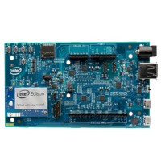 | 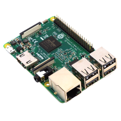     | 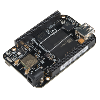       | 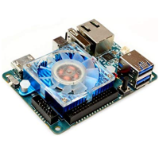 |
| SO Testado: Yocto Linux           | SO Testado: Raspbian               | SO Testado: Debian                        | SO Testado: N/A                   |
| Modelo Testado: Intel Edison      | Modelo Testado: RPi 2, 3           | Modelo Testado: BB Black Wireless         | Modelo Testado: N/A               |

Outros CC suportados:

* Intel Galileo (ainda não testado)
* Raspberry Pi Zero (ainda não testado)
* BeagleBone Blue (ainda não testado)
* BeagleBone Green (ainda não testado)

**Pilotos automáticos suportados:**

Os seguintes Pilotos Automáticos (APs) são suportados e foram testados.

| APM                             | Pixhawk                             |
|---------------------------------|-------------------------------------|
| 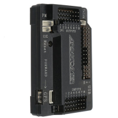  | 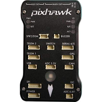  |
| Modelo Testado: APM v2.8        | Modelo Testado: Pixhawk v1.0        |

**VANTs suportados:**

O presente projeto dá suporte a um conjunto de VANTs e estão listados abaixo.

| Quadricóptero                      | Hexacóptero                        | Octacóptero                        | Asa Fixa                                |
|------------------------------------|------------------------------------|------------------------------------|-----------------------------------------|
| 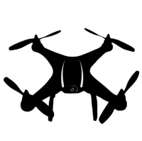 | 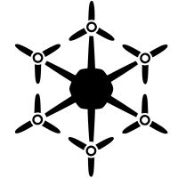 | 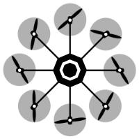 | 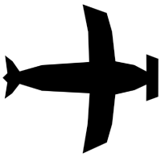 |
| Modelo Testado: Quadricóptero em X | Modelo Testado: N/A                | Modelo Testado: N/A                | Modelo Testado: N/A                     |
| Nome: iDroneAlpha                  | Nome: N/A (Drone Simões)           | Nome: N/A                          | Nome: N/A  (Ararinha)                   |

## Pré-Requisitos de Instalação (Software): 

Abaixo estão descritos os softwares necessários para execução, acompanhar a missão, executar os planejadores de rotas, criar missões e atualizar o projeto.

**Softwares básicos necessários para execução:**

* Java Runtime Environment [[Link](https://www.java.com/pt_BR/download/)] (Instalar no PC e no CC). Foi testado na versão do Java SE 1.8. Todos os códigos Java usaram o JDK 1.8.

:warning: **OBS:** a versão OpenJDK pode apresentar problemas com o UAV-Manager e UAV-GCS.

* Python 2.7.* [[Link](https://www.python.org/)] (Instalar no PC e no CC).
 
:warning: **OBS:** a versão Python 3.* não é totalmente suportada pelo Dronekit.

* Dronekit 2.9.* ou superior [[Link](http://python.dronekit.io/)] (Instalar no PC e no CC) (Licença Apache 2.0)

* Dronekit-SITL 3.2.* ou superior [[Link](http://python.dronekit.io/)] ((Instalar **somente** no PC) (Licença MIT, Apache 2.0 e GPL 3.0)

* Mavproxy 1.6.* ou superior [[Link](http://ardupilot.github.io/MAVProxy/html/index.html)] (Instalar no PC e no CC) (Licença GPL 3.0)

**Softwares necessários para acomponhar a execução da missão:**

* QGroundControl [[Link](http://qgroundcontrol.com/)] (Instalar somente no PC) (Licença dupla Apache 2.0 e GPL 3.0)
ou 
* APM Planner 2.0 [[Link](http://ardupilot.org/planner2/index.html)] (Instalar somente no PC) (Licença GPL 3.0)
ou 
* Mission Planner [[Link](http://ardupilot.org/planner/docs/mission-planner-overview.html)] (Funciona somente em Windows) (Instalar somente no PC) (Licença GPL 3.0)
ou 
* Qualquer outra Ground Control Station (GCS) do seu interesse (Instalar somente no PC)

**Software necessário para execução de alguns planejadores de rotas:**

* IBM ILOG CPLEX Optimization Studio [[Link](https://www.ibm.com/developerworks/br/downloads/ws/ilogcplex/index.html)] (Funciona somente em arquiteturas x86 e x64) (Instalar no PC e CC) (Licença Proprietária)

OBS: A versão do CPLEX que avaliada foi: IBM(R) ILOG(R) CPLEX(R) Interactive Optimizer 12.5.1.0.

:warning: **OBS:** A instalação do CPLEX ocupa aproximadamente 1268 MB de espaço em disco.

:warning: **OBS:** Após instalar deve-se, copiar o arquivo cplex.jar do diretório `.../IBM/ILOG/CPLEX_StudioXXXX/cplex/lib/` para todos os planejadores de rota que utilizam pragramação matemática como em: `.../UAV-Toolkit/Modules-MOSA/HGA4m/lib/` e `.../UAV-Toolkit/Modules-MOSA/CCQSP4m/lib/`.

**Software necessário para criar uma nova missão para o Drone:**

* Google-Earth [[Link](https://www.google.com/earth/index.html)] (Instalar somente no PC) (Licença Apache 2.0)

**Software necessário para fazer atualizações no projeto (incluindo melhorias):**

* IDE Netbeans [[Link](https://netbeans.org/downloads/)] (Instalar somente no PC) (Licença dupla CDDL 1.0 e GPL 2.0)
ou 
* Qualquer outra IDE para Java do seu interesse (você terá que fazer a importação do projeto) (Instalar somente no PC)

**Software necessário para obter últimas atualizações do projeto:**

* Git [[Link](https://git-scm.com/)] (Instalar no PC e no CC) (Licença Apache 2.0)

### Versões dos Programas Instalados:

Abaixo encontra-se alguns comandos para verificar as versões de alguns dos programas instalados. Use estes comandos para testar se tudo está instalado corretamente.

`$ java --version` ou `$ java -version`

`$ python --version`

`$ dronekit-sitl --version`

`$ mavproxy.py --version`

## Instalação:

* **Fazendo a Instalação**

Existem basicamente duas formas de instalar o ambiente UAV-Toolkit:

1. Uma das formas de instalar é clonando o repositório:

`git clone https://github.com/jesimar/UAV-Toolkit.git`

2. Uma outra forma é fazendo o download do último release do nosso projeto:

`https://github.com/jesimar/UAV-Toolkit/releases`

Uma vez terminado, o projeto já está pronto para o uso. Navegue até o diretório RAIZ. Neste caso você estará em ./UAV-Toolkit/

* **Verificando a Instalação**

Opcional: Caso deseje-se verifica se tudo está instalado corretamente execute o script "tests-sw-installed.sh" localizado em /UAV-Toolkit/Scripts/tests-sw-installed.sh. O mesmo faz a verificação de um conjunto de programas informando a sua versão e irá ocorrer um erro caso algum deles não esteja corretamente instalado.

Comando para verificação: 
`UAV-Toolkit/Scripts$ ./tests-sw-installed.sh`

Possível saída do comando: 
```
===============================================
-------------------Test Java-------------------
java version "1.8.0_151"
Java(TM) SE Runtime Environment (build 1.8.0_151-b12)
Java HotSpot(TM) 64-Bit Server VM (build 25.151-b12, mixed mode)
java-ok
-------------------Test Python-----------------
Python 2.7.13
Python 2.7.13
python-ok
------------------Test Dronekit----------------
dronekit-ok
---------------Test Dronekit SITL--------------
3.2.0
dronekit-sitl-ok
-----------------Test MavProxy-----------------
WARNING: You should uninstall ModemManager as it conflicts with APM and Pixhawk
MAVProxy is a modular ground station using the mavlink protocol
MAVProxy Version: 1.6.1
mavproxy-ok
------------------Test UAV-IFA-----------------
UAV-IFA version: 4.0.0
uav-ifa-ok
-----------------Test UAV-MOSA-----------------
UAV-MOSA version: 4.0.0
uav-mosa-ok
------------------Test UAV-GCS-----------------
UAV-GCS version: 4.0.0
uav-gcs-ok
===============================================
```

* **Sintese da instalação**

A imagem abaixo sintetiza todos os softwares que devem ser instalados na plataforma. Esta imagem distingue em qual dispositivo PC ou CC você deve instalar os softwares de acordo com o tipo de teste que pretende-se fazer (SITL, HITL, REAL_FLIGHT).


## Compilação dos Projetos/Códigos em C/C++

Por ser dependente de arquitetura todos os códigos em C/C++ utilizados devem ser compilados para a sua arquitetura/máquina antes de executar qualquer simulação.

Para visualizar as opções de compilação possíveis digite: `/UAV-Toolkit/Scripts$ ./compile-all-code-c-cpp.sh --help`

Saída para esse comando:
```
=======================Compile Codes C/C++========================
How to use: 
    Format:  ./compile-all-code-c-cpp.sh COMPUTER_TYPE
    Example: ./compile-all-code-c-cpp.sh  RPi
    COMPUTER_TYPE:
        PC -> Personal Computer
        Edison -> Intel Edison
        RPi -> Raspberry Pi
        BBB -> BeagleBone Black
        Odroid -> Odroid
==============================Done================================
```

Para compilar os códigos C/C++ para o PC digite: `$ ./compile-all-code-c-cpp.sh PC`

Saída para esse comando:
```
=======================Compile Codes C/C++========================
Compiled replanner-making-line-c.c and replanner-making-line-cpp.cpp
Compiled planner-making-square-c.c and planner-making-square-cpp.cpp
Compiled A-Star.c
Compiled RouteStandard4m.c
==============================Done================================
```

## Configurações Antes da Execução

Existem dois arquivos que devem ser sempre conferidos antes de executar o ambinente que são: 

```
./UAV-Toolkit/Modules-Global/config-global.properties
./UAV-Toolkit/Modules-Global/config-param.properties
```

* O arquivo config-global.properties [[Link](./Modules-Global/config-global.properties/)] contém um conjunto de configurações que irá determinar o tipo de operação (SITL/HITL/REAL_FLIGHT), tipo de CC usado, tipo de planejadores/replanejadores usados, etc. 
* O arquivo config-param.properties [[Link](./Modules-Global/config-param.properties/)] contém alguns parâmetros do piloto automático que sempre é atualizado pelo sistema IFA antes da realização da missão. Pode-se alterar qualquer parâmetro do piloto automático nesse arquivo usando o esquema de chave, valor dado. 

:warning: **OBS:** Nunca execute o sistema sem antes conferir o conteúdo do arquivo "config-global.properties".

:warning: **OBS:** Cuidado, pois os nomes dos parâmetros do arquivo "config-param.properties" podem mudar dependendo da versão do firmware do AP que você está usando. Os valores que modifiquei lá são totalmente compatíveis com os firwares que venho usando na APM e Pixhawk, mas sempre confira isso.

## Como Executar

Existem basicamente três formas de executar o ambiente UAV-Toolkit que são: 

1. Forma 1 -> Execução em SITL (Necessita apenas de um PC):
2. Forma 2 -> Execução em HITL (Necessita de um PC e um CC): 
3. Forma 3 -> Execução em REAL_FLIGHT (Necessita de um PC, um CC e um UAV):

Para executar qualquer uma das três formas acima execute os seguintes scripts em um terminal diferente (localizados na pasta /UAV-Tookit/Scripts):

Forma 1 -> Execução em SITL (PC):

```
Ordem  Software/Aplicação                                      (Local de Execução)
1.     Abra uma GCS como o QGroundControl                      (PC)
2.     UAV-Toolkit/Scripts$ ./exec-gcs.sh                      (PC) 
3.     UAV-Toolkit/Scripts$ ./exec-sitl.sh LAT LNG             (PC)
4.     UAV-Toolkit/Scripts$ ./exec-mavproxy-sitl.sh            (PC)
5.     UAV-Toolkit/Scripts$ ./exec-s2dk.sh                     (PC)
6.     UAV-Toolkit/Scripts$ ./exec-ifa.sh                      (PC)
7.     UAV-Toolkit/Scripts$ ./exec-mosa.sh                     (PC)
```

Forma 2 -> Execução em HITL (PC + CC):

```
Ordem  Software/Aplicação                                      (Local de Execução)  (Observações)
1.     Abra uma GCS como o QGroundControl                      (PC)
2.     UAV-Toolkit/Scripts$ ./exec-gcs.sh                      (PC)
3.     UAV-Toolkit/Scripts$ ./exec-sitl.sh LAT LNG             (PC)
4.     UAV-Toolkit/Scripts$ ./exec-mavproxy-hitl.sh IP_GCS     (CC)
5.     UAV-Toolkit/Scripts$ ./exec-s2dk.sh                     (CC)
6.     UAV-Toolkit/Scripts$ ./exec-ifa.sh                      (CC)                 (Necessita de sudo na RPi)
7.     UAV-Toolkit/Scripts$ ./exec-mosa.sh                     (CC)                 (Necessita de sudo na RPi)
```

Forma 3 -> Execução em REAL_FLIGHT (PC + CC + UAV):

```
Ordem  Software/Aplicação                                      (Local de Execução)  (Observações)
1.     Abra uma GCS como o QGroundControl                      (PC)
2.     UAV-Toolkit/Scripts$ ./exec-gcs.sh                      (PC)
3.     UAV-Toolkit/Scripts$ ./exec-mavproxy-real-?.sh IP_GCS   (CC)
4.     UAV-Toolkit/Scripts$ ./exec-s2dk.sh                     (CC)
5.     UAV-Toolkit/Scripts$ ./exec-ifa.sh                      (CC)                 (Necessita de sudo na RPi)
6.     UAV-Toolkit/Scripts$ ./exec-mosa.sh                     (CC)                 (Necessita de sudo na RPi)
```

:warning: **OBS:** Deve-se executar cada um desses scripts em um terminal diferente.

:warning: **OBS:** Você pode abrir/executar outras estações de controle de solo para acompanhar a execução da missão, com por exemplo, APM Planner 2.0 ou Mission Planner. Caso use o Mission Planner será necessário usar a conexão com UDP baudrate (57600) e porta (14550).

:warning: **OBS:** Ao executar os scripts exec-mavproxy-hitl.sh e exec-mavproxy-real-?.sh podem aparecer as seguintes mensagens de erro no CC (Intel Edison). 
Failed to load module: No module named terrain. Use 'set moddebug 3' in the MAVProxy console to enable traceback. 
Failed to load module: No module named adsb. Use 'set moddebug 3' in the MAVProxy console to enable traceback. 
Ambas as mensagens não comprometem os experimentos e/ou voo.

:warning: **OBS:** O comando sudo pode ser necessário antes dos comandos exec-ifa.sh e exec-mosa.sh caso esteja-se executando em HITL e REAL_FLIGHT. A placa Raspberry Pi 3 reclama de permissões, em alguns casos específicos, como fazer o recálculo de rotas emergenciais.

:warning: **OBS:** Antes de executar o UAV-IFA (exec-ifa.sh) é necessário aguardar até que o software UAV-S2DK esteja pronto (aguardando conexão).

A imagem abaixo sintetiza as três formas possíveis de execução dos softwares.


A imagem abaixo mostra como deve ser feita as conexões entre o PC e o CC para fazer os experimentos HITL.

| HITL GCS e Raspberry Pi                        | HITL GCS e BeagleBone Black                     | HITL GCS e Intel Edison                           |
|------------------------------------------------|-------------------------------------------------|---------------------------------------------------|
| 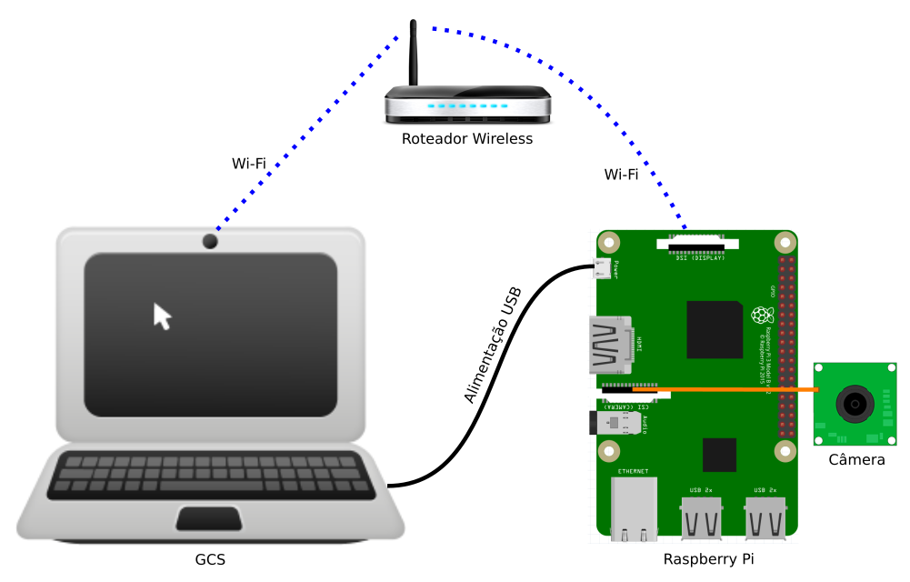                | 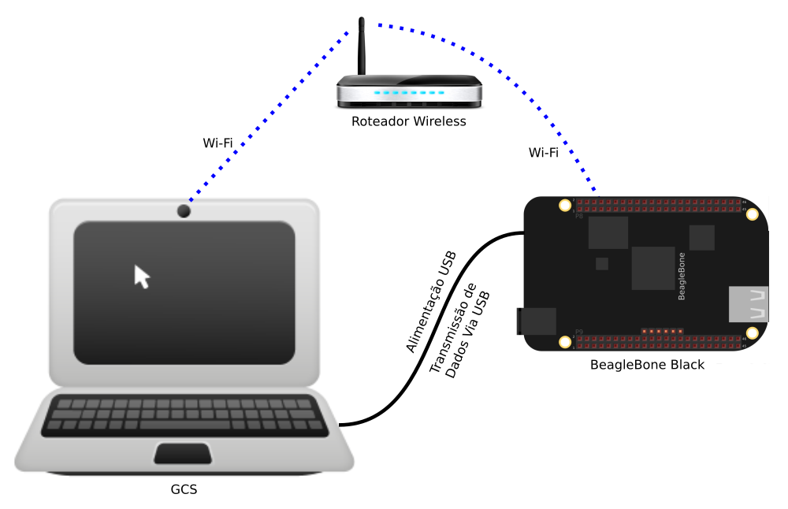                 | 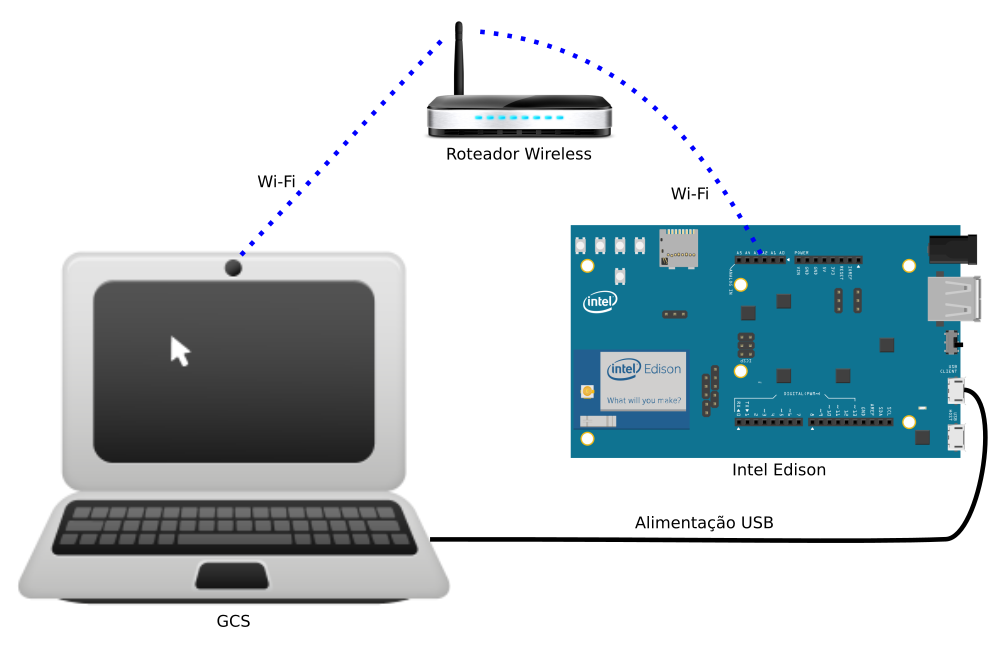                |
| Aqui a transmissão de dados deve ser feita através de uma intranet ou internet | Aqui transmissão de dados poderá ser feita através de uma intranet ou internet, ou ainda, através do próprio cabo no IP 192.168.7.2 | Aqui a transmissão de dados deve ser feita através de uma intranet ou internet |

A imagem abaixo mostra como deve ser feita as conexões entre o PC, AP e o CC para fazer os experimentos Reais.

| REAL_FLIGHT GCS, APM e Raspberry Pi            | REAL_FLIGHT GCS, APM e BeagleBone Black         | REAL_FLIGHT GCS, APM e Intel Edison               |
|------------------------------------------------|-------------------------------------------------|---------------------------------------------------|
| 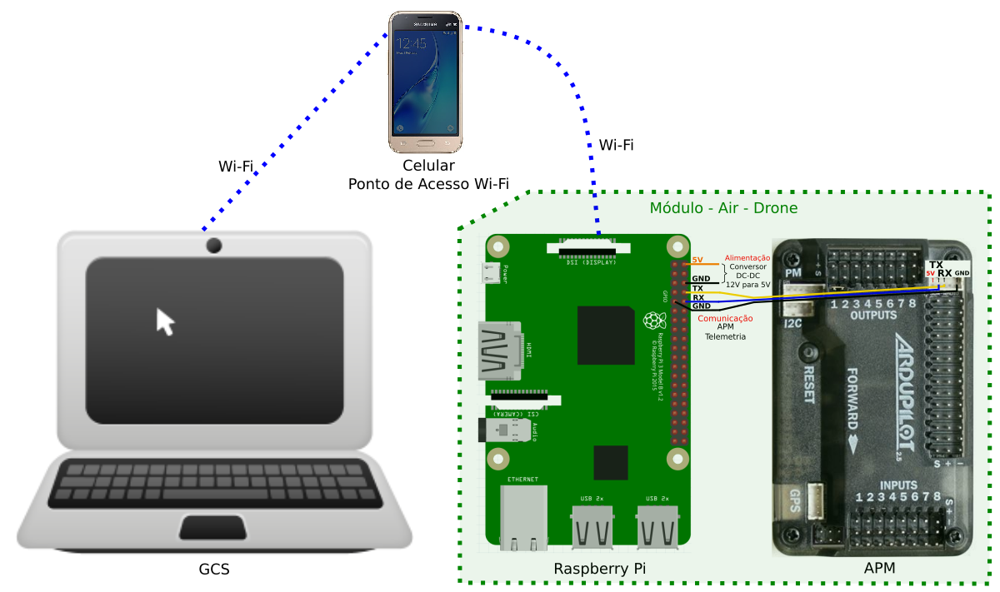     | 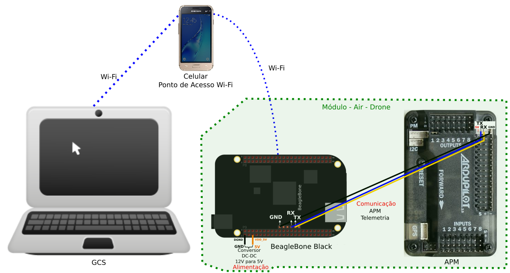      | 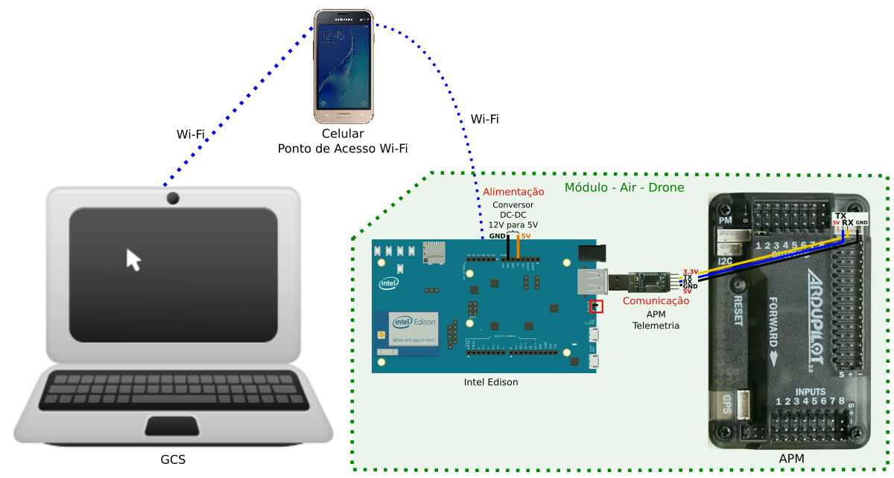     |

| REAL_FLIGHT GCS, Pixhawk e Raspberry Pi        | REAL_FLIGHT GCS, Pixhawk e BeagleBone Black     | REAL_FLIGHT GCS, Pixhawk e Intel Edison           |
|------------------------------------------------|-------------------------------------------------|---------------------------------------------------|
| 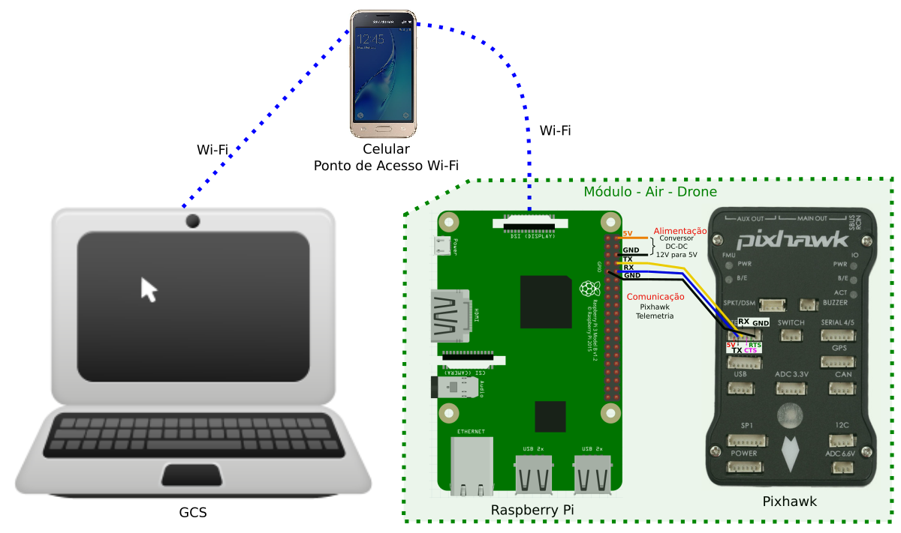 | 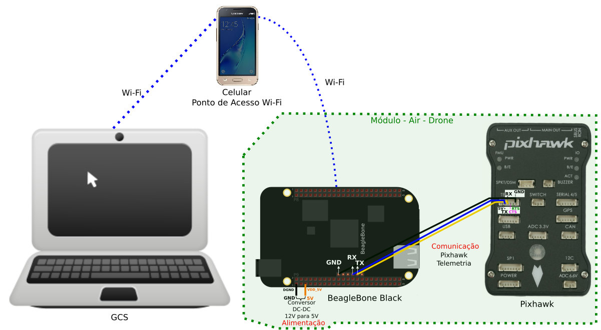  | 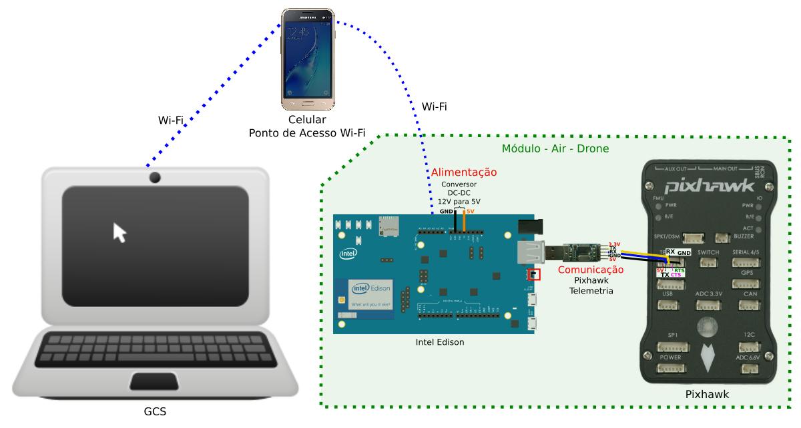 |

## Como Terminar a Execução

Após terminar uma simulação deve-se encerrar as aplicações executadas.
A forma de se terminar a execução do sistema é matando cada um dos terminais na ordem inversa que forma executados.
No Linux faça assim:

```
Ordem  Software/Aplicação                                      Comando para Encerrar/Matar
1.     UAV-Toolkit/Scripts$ ./exec-mosa.sh                     Ctrl+C
2.     UAV-Toolkit/Scripts$ ./exec-ifa.sh                      Ctrl+C
3.     UAV-Toolkit/Scripts$ ./exec-s2dk.sh                     Ctrl+C
4.     UAV-Toolkit/Scripts$ ./exec-mavproxy-*.sh               Ctrl+C
5.     UAV-Toolkit/Scripts$ ./exec-sitl.sh                     Ctrl+C
```

:warning: **OBS:** Caso encerre as aplicações em outra ordem, alguns aplicações poderão lançar alguma exceção. Mas isso não compromete em nada o sistema.

:warning: **OBS:** Não é necessário fechar o QGroundControl ou outras GCS, para fazer outras simulações. É uma boa prática clicar em desconecte do VANT após matar as aplicações, mas não é necessário.

:warning: **OBS:** Caso se deseje copiar os logs gerados na simulação/voo para uma posterior análise. Os logs serão salvos na pasta `/UAV-Toolkit/Results/DataDaCopia/`. Dessa forma, execute o seguinte comando: `UAV-Toolkit/Scripts$ ./exec-copy-files-results.sh`

:warning: **OBS:** Caso não se deseje analisar os logs gerados na simulação/voo é uma boa prática limpar os logs gerados pelo sistema. Dessa forma, execute o seguinte comando: `UAV-Toolkit/Scripts$ ./clear-simulations.sh`

## Vídeo da Instalação e Execução

Abaixo encontra-se um vídeo de como instalar o ambiente UAV-Toolkit e todas as suas dependências, além também de como configurar alguns arquivos para execução e por fim como executar o ambiente. 

O link para o youtube pode ser acessado aqui: https://youtu.be/G4YxFfW4OI0

[](https://youtu.be/G4YxFfW4OI0 "Instalando/Configurando/Executando o UAV-Toolkit")

<!--
## Drones Construídos:

Abaixo encontram-se alguns dos drones construídos e utilizados durante esse trabalho.

| iDroneAlpha                    | iDroneBeta                     | iDroneGamma                    | iDroneDelta                    |
|--------------------------------|--------------------------------|--------------------------------|--------------------------------|
|  |   |  |  |
| Modelo: Quadricóptero          | Modelo: Quadricóptero          | Modelo: Quadricóptero          | Modelo: Quadricóptero          |
| AP: APM v2.8                   | AP: Pixhawk v1                 | AP: APM v2.8                   | AP: APM v2.8                   |
| GPS: Neo M6N                   | GPS: Neo M8N                   | GPS: Neo M8N                   | GPS: Neo M6N                   |
| CC: Intel Edison               | CC: Raspberry Pi 3             | CC: Beagle Bone Black          | CC: Odroid                     |
-->

## Citação

Se você usar o UAV-Toolkit, por favor, cite minha Qualificação de Doutorado [[PDF](./Docs/Qualificação-Jesimar-2017.pdf)].

```
@phdthesis{ArantesJS2017Tese,
  author = {Jesimar da Silva Arantes},
  title = {Sistema autônomo para supervisão de missão e segurança de voo em VANTs},
  school = {Universidade de São Paulo (USP)},
  year = {2017},
  month = {ago},
  pages = {1--140},
  note = {São Carlos, SP},
  type = {Qualificação de Doutorado}
}
```

O artigo abaixo contém um pouco dos detalhes do sistema IFA e MOSA implementados [[Link](https://dl.acm.org/citation.cfm?id=3071178.3071302)].

```
@inproceedings{ArantesJS2017GECCO,
  author = {da Silva Arantes, Jesimar and da Silva Arantes, M\'{a}rcio and Toledo, Claudio Fabiano Motta and J\'{u}nior, Onofre Trindade and Williams, Brian C.},
  title = {An Embedded System Architecture Based on Genetic Algorithms for Mission and Safety Planning with UAV},
  booktitle = {Proceedings of the Genetic and Evolutionary Computation Conference},
  series = {GECCO '17},
  year = {2017},
  isbn = {978-1-4503-4920-8},
  location = {Berlin, Germany},
  pages = {1049--1056},
  numpages = {8},
  url = {http://doi.acm.org/10.1145/3071178.3071302},
  doi = {10.1145/3071178.3071302},
  acmid = {3071302},
  publisher = {ACM}
} 
```

## Contribuidores

Os principais contribuidores desse projeto podem ser encontrados [aqui](https://github.com/jesimar/UAV-Toolkit/blob/master/AUTHORS)

## Changelog

As principais modificações do sistema podem ser acessadas [aqui](https://github.com/jesimar/UAV-Toolkit/blob/master/CHANGELOG.md). 

## Licença

UAV-Toolkit está disponível sobre código aberto com permissões [GNU General Public License v3.0](https://github.com/jesimar/UAV-Toolkit/blob/master/LICENSE). 

<!--
## Características do Sistema

* O sistema IFA é o servidor (mestre, host) tem que ser executado antes do MOSA.
* O sistema IFA suporta apenas um cliente MOSA. 
* Não é possível ao projetista da missão mandar gravar um vídeo e em seguida mandar retirar uma fotografia, pois o recurso estará em uso. Isso não é verificado pelo sistema.
* O sistema IFA suporta apenas um recalculo de rota para pouso emergencial. Ele não aceita chamar duas vezes o MPGA4s, por exemplo.

## Arquitetura de Hardware


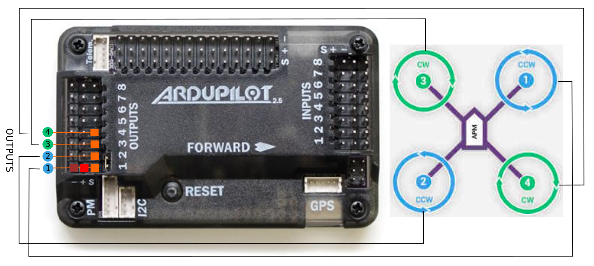


-->
