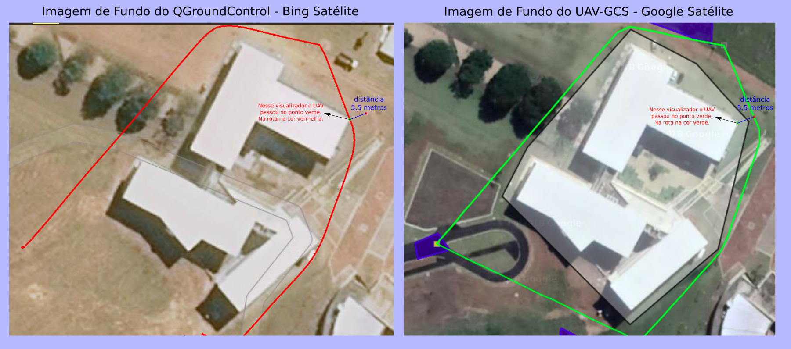

# UAV-Mission-Creator

O projeto UAV-Mission-Creator foi desenvolvido para auxiliar a projetar missões e mapas usando o [Google Earth](https://www.google.com/earth/index.html). Este projeto foi desenvolvido em Java usando o IDE [Netbeans](https://netbeans.org/).

## Visão Geral
 
Esse projeto conta com um conjunto de ferramentas para conversões de rotas em coordenadas cartesianas em coordenadas geograficas (e vice-versa), conta também com conversões de mapas projetados no Google Earth para mapas em coordenadas cartesianas. Dentre inumeras outras funcionalidades.

Este sistema é o responsável por a partir de um arquivo de mapa geográfico (kml) (feito no Google Earth) transformar esse arquivo em um conjunto de arquivos necessários aos algoritmos de planejamento de caminho (HGA4m, CCQSP4m, AStar4m, G-Path-Planner4m) e replanejamento de caminho (MPGA4s, GA4s, GH4s, DE4s, MS4s, G-Path-Replanner4s).

A ideia geral do sistema pode ser vista na figura abaixo.

Os arquivos de entrada/saída desse sistema ficam dentro do diretório: /UAV-Toolkit/Missions/

## Criando o arquivo KML

Para a criação do arquivo KML basta abrir o Google Earth. E criar um mapa, na criação desse mapa as seguinte tags devem ser utilizadas.

As seguintes notações foram definidas afim de mapear as regiões em que ocorrerá a missão:

* **map_obstacle**: esta região define as áreas que o VANT está estritamente proibido de sobrevoar ou pousar, podendo representar, por exemplo, edifícios, casas, bases militares, aeroportos, entre outras.
* **map_penalty**: esta região define as áreas que o VANT pode sobrevoar, mas não deve pousar. Caso pouse, uma penalização será aplicada. Isso porque nessa área encontram-se estruturas de tamanho mediano como as árvores, lagos, montanhas, etc.
* **map_bonus**: esta região define as áreas que o VANT pode sobrevoar e pousar. Essa região pode representar a pista de pouso do VANT, planícies, entre outras.
* **map_frontier**: define a fronteira da missão, ou seja, uma região a qual o VANT jamais deve sobrevoar fora da mesma, delimitando assim o espaço de voo/missão.

As seguintes notações foram definidas afim de registrar as atividades relacionadas a missão:

* **geo_base**: define um ponto de referência para a transformação entre os sistemas de coordenadas cartesianas e geográficas.
* **waypoint**: define um ponto de passagem que a aeronave deve cumprir durante a sua missão. Os waypoints definidos serão utilizados pelo MOSA para estabelecer a rota a ser seguida pela aeronave.
* **cmd_picture**: define um ponto em que uma fotografia deve ser retirada. O sistema MOSA ao atingir esse ponto efetua a retirada da fotografia.
* **cmd_photo_seq**: define um ponto a partir do qual uma sequência de fotografias serão retiradas. O sistema MOSA ao atingir esse ponto irá iniciar a retirada da(s) fotografia(s) em sequência.
* **cmd_video**: define um ponto a partir do qual se iniciara a filmagem da região.
* **cmd_spraying_begin**: define um ponto a partir do qual se iniciara a pulverização da região.
* **cmd_spraying_end**: define um ponto de término da pulverização.

## Arquivos de Entrada

* **config-mission.properties**: Um arquivo de configurações (config-mission.properties) encontra-se também disponível para configuração de um conjunto de propriedades importantes.

* **mission.kml**: Um arquivo com a missão (.kml) planejada feito usando o Google Earth. Este arquivo pode ter qualquer nome, mas deve possuir a extensão kml. Extensões kmz ainda não são suportadas.

## Arquivos de Saída

* **featureMission.txt** -> Pontos contendo as principais especificações/características da missão.
* **geoBase.txt** -> Ponto base em coordenadas geográficas para conversão entre coordenadas cartesianas e geográficas e vice-versa.
* **map-full.json** -> Mapa completo em formato .JSON contendo os obstáculos, regiões bonificadores e penalizadores.
* **map-full.sgl** -> Mapa completo em formato .SGL contendo os obstáculos, regiões bonificadores e penalizadores.
* **map-full.xml** -> Mapa completo em formato .XML contendo os obstáculos, regiões bonificadores e penalizadores.
* **map-nfz.json** -> Mapa contendo os obstáculos em formato .JSON.
* **map-nfz.sgl** -> Mapa contendo os obstáculos em formato .SGL.
* **map-nfz.xml** -> Mapa contendo os obstáculos em formato .XML.
* **map-nfz-astar.sgl** -> Mapa contendo os obstáculos em formato .SGL. Usado pelo algoritmo A-Star4m.
* **mission-ccqsp.sgl** -> Mapa e especificação da missão em formato .SGL. Usado pelo algoritmo CCQSP4m.
* **waypointsMission.txt** -> Especificação dos waypoints que deseja-se sobrevoar com o VANT.

## Como Usar

Abaixo encontra-se alguns vídeos mostrando um pouco como projetar os mapas usando o Google Earth.

## Problemas

:warning: **OBS:** De acordo com algumas medidas minhas a imagem do Google Earth (Google Satélites) e a imagem de fundo do QGroundControl (Bing Satélites) possuem um deslocamento de entre 5,0 metros a 7,0 metros. 
Isso pode impactar e muito durante o planejamento da missão e fazer o drone colidir com algum obstáculo. Pois, o meu planejamento é feito baseado em waypoints e obstáculos e eles são definidos
baseados na imagem obtida. Eu costumo colocar uma margem de erro nos obstáculos, mas de acordo com tais medidas obtidas preciso aumentar ainda mais essa margem para pelo menos 7 metros, afim de garantir uma segurança mínima.
Nessa figura abaixo pode-se considerar as rotas na cor vermelha e verde como iguais, observando assim o erro de medida das imagens.

A Figura abaixo mostra a mesma rota obtida no software QGroundControl apenas mudando o tipo de mapa de Bing Satélities para Google Satélities. Nessa imagem foi ressaltado o deslocamento dos obstáculos em relação as duas rotas.

