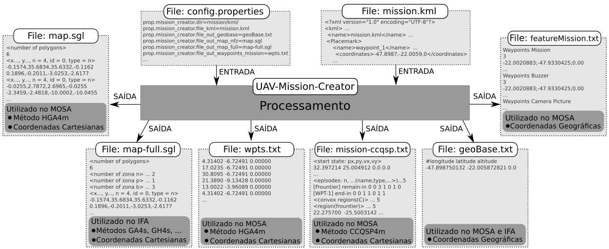

# UAV-Mission-Creator

O projeto UAV-Mission-Creator foi desenvolvido para auxiliar a projetar missões e mapas usando o [Google Earth](https://www.google.com/earth/index.html). Este projeto foi desenvolvido em Java usando o IDE [Netbeans](https://netbeans.org/).

## Visão Geral
 
Esse projeto conta com um conjunto de ferramentas para conversões de rotas em coordenadas cartesianas em coordenadas geograficas (e vice-versa), conta também com conversões de mapas projetados no Google Earth para mapas em coordenadas cartesianas. Dentre inumeras outras funcionalidades.

Este sistema é o responsável por a partir de um arquivo de mapa geográfico (kml) (feito no google earth) transformar esse arquivo em um conjunto de arquivos necessários aos algoritmos de planejamento de caminho (HGA4m) e replanejamento de caminho (MPGA4s, GA4s, GH4s, DE4s).

A ideia geral do sistema pode ser vista na figura abaixo.

Os arquivos de entrada/saída desse sistema ficam dentro do diretório: mission/kml/

## Arquivos de Entrada

* config-mission.properties: Um arquivo de configurações (config-mission.properties) encontra-se também disponível para configuração de um conjunto de propriedades importantes.

* mission.kml: Um arquivo com a missão (.kml) planejada feito usando o Google Earth.

## Arquivos de Saída

* map.sgl
* map-full.sgl
* geoBase.txt
* wpts.txt
* featureMission.txt
