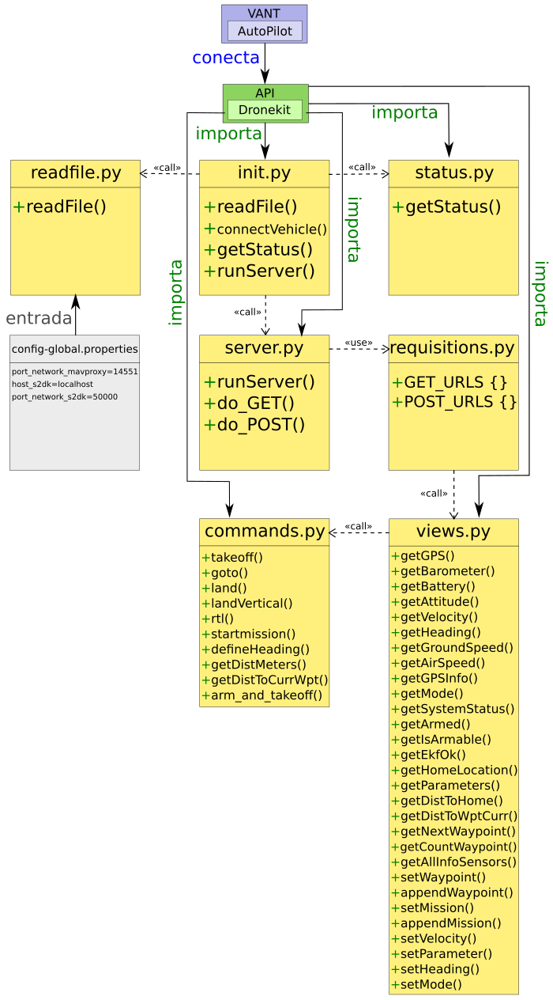

# UAV-S2DK

Aplicação em Python que disponibiliza através do protocolo HTTP com métodos GET e POST um conjunto serviços sobre a biblioteca Dronekit. Estes serviços são providos através de uma Interface que abstrai os comandos do Dronekit para o drone.

## Como Instalar

Esta aplicação possui algumas dependências de outros pacotes em Python. Dessa forma, é necessário fazer a instalação de alguns desses pacotes antes de executar a aplicação.

:warning: **OBS:** Deve-se ter instalado em seu computador o Python 2.7, o PIP, o dronekit, o dronekit-sitl e o MAVProxy.

Local para baixar o Python [[Link](https://www.python.org/downloads/)]

Comandos para instalar o PIP:

Linux: `$ sudo apt-get install python-pip python-dev`

Windows: `> python -m pip install -U pip`

Comando para instalar o Dronekit:

Linux: `$ sudo pip install dronekit`

Windows: `> python -m pip install dronekit`

Comando para instalar o Dronekit-SILT:

Linux: `$ sudo pip install dronekit-sitl`

Windows: `> python -m pip install dronekit-sitl`

Comando para instalar o MAVProxy:

Linux: `pip install MAVProxy`

Windows: `> python -m pip install MAVProxy`

Uma outra forma alternativa de fazer a instalação de todas as dependências do UAV-S2DK é usando o arquivo de requirements.txt. Dessa forma, digite no terminal o seguinte: `$ sudo pip install -r requirements.txt`

Dica: Caso conheça o ambiente do virtualenv, faça a instação dentro desse ambiente (isto que irá facilitar a sua vida).

Comando para descobrir se o pip está instalado `$ python -m pip --version`

## Como Executar

Para executar este código, primeiramente, deve-se executar os seguintes scripts (localizados na pasta Scripts): 

Forma 1 -> Execução em SITL-PC (PC - Personal Computer):

1. ./exec-sitl.sh                    (PC)
2. ./exec-mavproxy-local.sh          (PC)
3. ./exec-s2dk.sh                    (PC)

Forma 2 -> Execução em SITL-CC (CC - Companion Computer):

1. ./exec-sitl.sh                    (PC)
2. ./exec-mavproxy-cc-sitl.sh        (CC)
3. ./exec-s2dk.sh                    (CC)

Forma 3 -> Execução no Drone no CC:

1. ./exec-mavproxy-cc-real-*.sh      (CC)
2. ./exec-s2dk.sh                    (CC)

Em seguida é necessário executar mais alguma aplicação que faça as requisições ao UAV-S2DK, como exemplo, de aplicações tem-se: 
UAV-IFA, UAV-MOSA, UAV-Tests, UAV-Monitoring, UAV-PosAnalyser e UAV-Toolkit-C.


:warning: **OBS:** Caso dê algum problema verifique qual versão do python está configurada como default. A biblioteca do Dronekit, atualmente, dá suporta apenas ao Python 2.7. A versão do Dronekit para Python 3 está em desenvolvimento.

Comando para verificar qual a versão do python está em uso: `$ python --version`

Comando para verificar qual a versão do dronekit-sitl está em uso: `$ dronekit-sitl --version`

Comando para verificar qual a versão do MavProxy está em uso: `$ mavproxy.py --version`

## Arquivo de Entrada

No diretório Modules-Global tem-se um arquivo de propriedades (config-global.properties), em que se define que os IPs e as portas usada na comunicação entre os sistemas. 

```
prop.global.comm.host_s2dk=localhost
prop.global.comm.port_network_mavproxy=14551
prop.global.comm.port_network_s2dk=50000
```

## Requisições:

Métodos GET: 

* '/get-gps/'
* '/get-barometer/'
* '/get-battery/'
* '/get-attitude/'
* '/get-velocity/'
* '/get-heading/'
* '/get-groundspeed/'
* '/get-airspeed/'
* '/get-gpsinfo/'
* '/get-mode/'
* '/get-system-status/'
* '/get-armed/'
* '/get-is-armable/'
* '/get-ekf-ok/'
* '/get-home-location/'
* '/get-parameters/'
* '/get-distance-to-home/'
* '/get-distance-to-waypoint-current/'
* '/get-next-waypoint/'
* '/get-count-waypoint/'
* '/get-all-sensors/'

Métodos POST:

* '/set-waypoint/'
* '/append-waypoint/'
* '/set-mission/'
* '/append-mission/'
* '/set-velocity/'
* '/set-parameter/'
* '/set-heading/'
* '/set-mode/'

## Como Fazer Requisições usando o Navegador (Browser):

Para fazer as requisições do tipo GET basta digitar algumas dos comandos abaixo na barra de endereços do Browser:

```
http://localhost:50000/get-gps/
http://localhost:50000/get-barometer/
http://localhost:50000/get-battery/
http://localhost:50000/get-attitude/
http://localhost:50000/get-velocity/
http://localhost:50000/get-heading/
http://localhost:50000/get-groundspeed/
http://localhost:50000/get-airspeed/
http://localhost:50000/get-gpsinfo/
http://localhost:50000/get-mode/
http://localhost:50000/get-system-status/
http://localhost:50000/get-armed/
http://localhost:50000/get-is-armable/
http://localhost:50000/get-ekf-ok/
http://localhost:50000/get-home-location/
http://localhost:50000/get-parameters/
http://localhost:50000/get-distance-to-home/
http://localhost:50000/get-distance-to-waypoint-current/
http://localhost:50000/get-next-waypoint/
http://localhost:50000/get-count-waypoint/
http://localhost:50000/get-all-sensors/
```

Uma ferramenta que pode-se ser utilizada é o Postman [[Link](https://chrome.google.com/webstore/detail/postman/fhbjgbiflinjbdggehcddcbncdddomop?hl=en)] que pode ser adicionada como uma extensão do seu navegador (Chrome). Esta ferramenta permite testar os métodos GET e POST.

Para fazer as requisições do tipo POST apenas digitar os comandos abaixo na barra de endereços não é o suficiente, pois é necessário enviar o arquivo da mensagem junto:

```
http://localhost:50000/set-waypoint/
http://localhost:50000/append-waypoint/
http://localhost:50000/set-mission/
http://localhost:50000/append-mission/
http://localhost:50000/set-velocity/
http://localhost:50000/set-parameter/
http://localhost:50000/set-heading/
http://localhost:50000/set-mode/
```

## Diagrama de Dependência

Abaixo encontra-se um diagrama de dependência do software UAV-S2DK.



Neste diagrama de dependêdia podemos perceber claramente o funcionamento do sistema. Lembre-se que as setas tracejadas (dependências) apontam para o arquivo dependente. Foram incorporados nesse diagrama o VANT com o seu piloto automático (AP) que são os elementos mais importantes para esta aplicação. A API do Dronekit conecta-se ao piloto automático. O arquivo init.py, inicialmente, manda fazer a leitura de um arquivo de configurações [descrito aqui](https://github.com/jesimar/UAV-Toolkit/tree/master/UAV-S2DK#arquivo-de-entrada) e feito no arquivo readfile.py. Em seguida, se conecta ao veículo (AP), então e retornado todos os principais status do veículo (feito no arquivo status.py). Posteriormente, inicia-se a parte mais importante que é a execução de um servidor HTTP que atende a requisições do tipo GET e POST (feita no arquivo server.py). Os nomes dos métodos GET e POST foram mapeados em uma estrutura de dicionário no arquivo requisitions.py. As funções dos métodos GET e POST estão definidas em views.py, por sua vez quando tem que enviar algum comando mavlink para o drone é feito através do arquivo commands.py.

:warning: **OBS:** a função get-home-location() não está mais sendo usada. Ela apresenta um problema no código do dronekit eventualmente. Essa função deu problema também com o piloto Pixhawk.

:warning: **OBS:** a função set-heading() não funciona muito bem, precisa melhorá-la antes de usá-la. Ela nem sempre faz o que se deseja, mas não dá nenhum bug.
